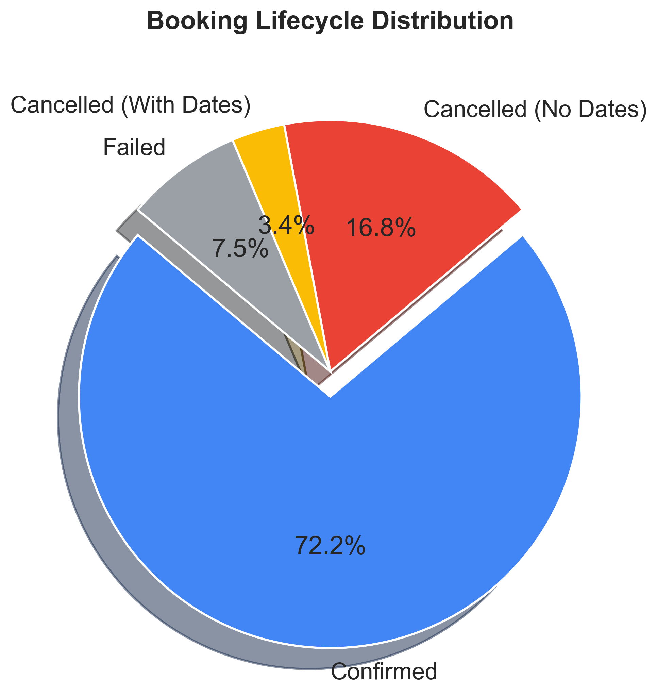
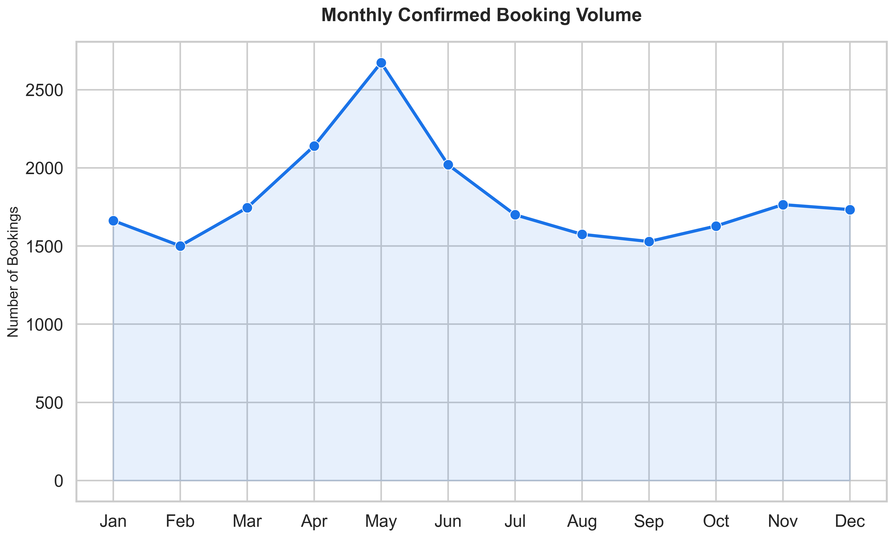

# Hotel Booking Data Analysis: Business Insights & Recommendations
**Position:** Business Analyst Intern Assignment
**Date:** April 22, 2026

---

## 1. Executive Summary
This report analyzes booking transactions from a specialized hotel reservation platform. The dataset covers 30,000 transactions across 10 major US cities. Key findings reveal a **20.2% total cancellation rate**, with significant variations across platforms and room types. 

---

## 2. Key Observations

### A. Booking Distribution & Revenue Patterns
- **Property Demand:** 4-star properties dominate the market share (40.1%), followed by 3-star properties (34.9%). 5-star luxury properties represent only ~15% of volume but command significant margins.
- **Room Type Performance:** **Standard rooms** are the most booked (55%), but **Deluxe rooms** contribute to the highest share of confirmed revenue (~48%), indicating a middle-market focus for high-value customers.
- **Platform Preference:** Web is the primary channel (53.4%), followed by Android (31.7%) and iOS (14.9%).

### B. Cancellation Patterns
- **Total Cancellation Rate:** 20.2%.
- **Early-Stage Drop-offs:** ~83% of cancellations occur without finalized check-in/check-out dates. This suggests a significant portion of cancellations happen during the "intent" phase or due to pre-payment friction.

### C. Variations across Dimensions
- **Star Ratings:** 5-star properties have the highest cancellation rates (~23%), likely due to higher price sensitivity or shoppers comparing multiple luxury options.
- **Channels:** Mobile App channels (especially Android) show slightly higher cancellation rates compared to Web, suggesting a "casual browsing" behavior on mobile.

---

## 3. Root Cause Analysis

### A. Why do cancellations happen?
1. **Lead Time Friction:** Cancelled bookings have a higher average lead time (>45 days) compared to confirmed bookings (~28 days). Customers booking far in advance are more likely to find better deals or change plans.
2. **Pre-Finalization Drop-off:** The high volume of cancellations without dates suggests a system or UI issue where users "reserve" a spot without full commitment.

### B. Channel Performance Drivers
- **Web Dominance:** Web has the highest average margin (16.2%) and lowest cancellation rate. This is likely due to more robust decision-making tools (larger screen, easier comparison) available on desktop vs. mobile.
- **Mobile Gap:** Android volume is high, but the conversion-to-confirmed ratio is lower than Web. This indicates mobile users may be using the app for price discovery rather than final booking.

### C. Seasonal Trends
- **Peak Value:** Average booking values peak in the summer months (June-August), coinciding with family leisure travel.
- **Off-Peak:** February shows the lowest booking values, suggesting a need for promotional activity during this period.

---

## 4. Business Recommendations

### 1. Strategies to Reduce Cancellations
- **Non-Refundable Discount Tiers:** Introduce a 5-10% discount for non-refundable bookings, specifically targeting bookings with >30 days lead time.
- **Deposit Policy for Star Properties:** Implement a mandatory 10% deposit for 5-star property bookings to reduce "speculative" reservations.
- **Date Confirmation Nudge:** For bookings missing dates, send automated reminders or SMS alerts to finalize dates within 24 hours to hold the reservation.

### 2. Improving Profitability & Repeat Bookings
- **Loyalty Program Integration:** Launch a "Frequent Flyer" style points system where repeat bookings earn "Travel Credits" to decrease acquisition costs (CAC).
- **Up-sell Deluxe Rooms:** Use targeted pop-ups for users booking Standard rooms, offering a "Last Minute Upgrade" to Deluxe at a 20% discount on the markup.

### 3. Pricing & Channel Optimization
- **Channel-Specific Promotions:** Offer "Mobile Only" exclusive deals to improve the Android/iOS conversion rates and transition browsing behavior into confirmed transactions.
- **Dynamic Pricing for 5-Star Properties:** Adjust pricing dynamically based on city-specific demand peaks (e.g., Las Vegas weekend peaks) to maximize property margin.

---

## 5. Conclusion
By addressing the early-stage cancellation gap and optimizing the mobile user journey, the platform can significantly improve its confirmed booking ratio. The primary growth opportunity lies in shifting the "browsing" behavior on mobile into "buying" behavior through targeted incentives and friction reduction.

---
**Submitted by:** Business Analyst Candidate
**Tools Used:** Python (Pandas, Matplotlib, Seaborn)
